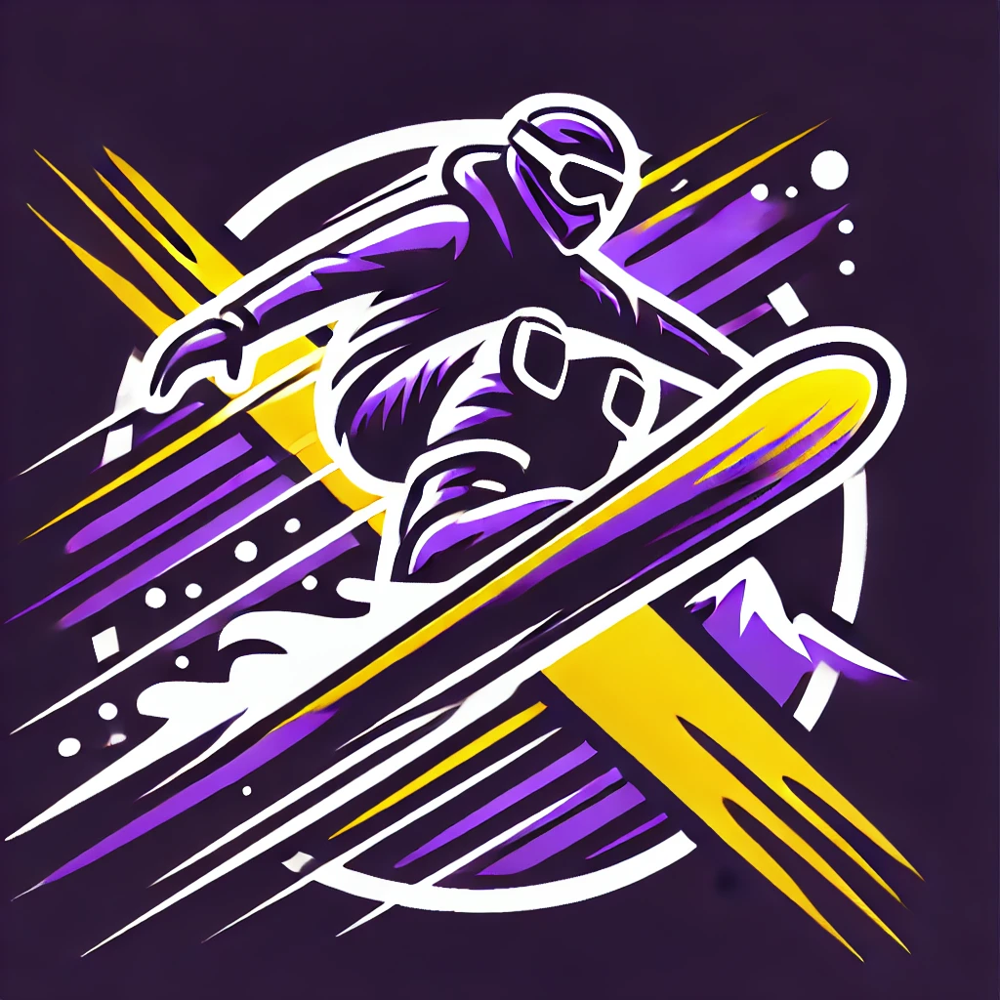

📌 Documentação do Projeto - XtremeReach

📍 Introdução

O XtremeReach é um projeto focado em marketing para esportes radicais. O objetivo principal é conectar entusiastas e empresas do setor, promovendo locais que oferecem experiências de esportes radicais e aumentando sua visibilidade por meio de uma plataforma digital.

🚀 Objetivo do Projeto

O projeto visa criar um site interativo onde os usuários possam encontrar e cadastrar locais especializados em esportes radicais. A plataforma permitirá que empresas e profissionais divulguem seus serviços, alcancem um público maior e facilitem a descoberta de novas aventuras para os praticantes desses esportes.

🌍 Tecnologias Utilizadas

O XtremeReach é construído utilizando um conjunto moderno de tecnologias para garantir eficiência e escalabilidade:

Frontend: React.js
Backend: Node.js com Express.js
Banco de Dados: MongoDB
Gerenciamento de Requisições HTTP: Axios

Controle de Versão: Git e GitHub

🛠️ Funcionalidades Principais

1.Cadastro e Gerenciamento de Locais

 * Empresas podem cadastrar e editar informações sobre os locais.
 * Os usuários podem visualizar os locais disponíveis para esportes radicais.

2.Autenticação de Usuários

 * Login e registro para usuários e empresas.
 * Segurança e proteção dos dados através de autenticação JWT.

3.Listagem e Filtros

 * Pesquisa de locais com base em categorias, localização e tipo de esporte.
 * Sistema de filtragem para facilitar a busca.

4.Integração com Mapas

 * Exibição de locais em um mapa interativo para melhor experiência do usuário.

🔗 Considerações Finais

O XtremeReach foi desenvolvido para impulsionar o setor de esportes radicais, proporcionando uma plataforma intuitiva e acessível tanto para empresas quanto para entusiastas. Através do uso de tecnologias modernas, buscamos garantir uma experiência dinâmica e eficiente para os usuários.

🚀 Desenvolvido por Matheus Dias e Arthur Jansen para o projeto XtremeReach.

